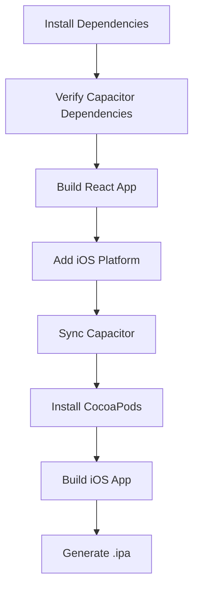

# 🍎 iOS Build Fix - Complete Solution

## 🔍 Root Cause Analysis

**Error**: `Unable to find node_modules/@capacitor/ios. Are you sure @capacitor/ios is installed?`

**Cause**: The `@capacitor/ios` dependency was missing from `package.json`, causing Capacitor sync to fail.

## ✅ Fixes Applied

### 1. **Added Missing Capacitor iOS Dependency**
- **Added**: `"@capacitor/ios": "^7.4.3"` to `package.json`
- **Result**: Capacitor iOS platform is now properly installed

### 2. **Enhanced iOS Workflow Validation**
- **Added**: Capacitor dependencies verification step
- **Improved**: Error handling for missing config files
- **Added**: Build directory validation before sync

### 3. **Workflow Steps Updated**

#### Before (Failing):
```yaml
- name: Sync Capacitor
  run: npx cap sync ios  # Failed: @capacitor/ios not found
```

#### After (Fixed):
```yaml
- name: Verify Capacitor Dependencies
  run: |
    # Verify @capacitor/cli and @capacitor/ios are installed
    # Check Capacitor CLI accessibility

- name: Sync Capacitor  
  run: |
    # Validate config files exist
    # Verify build directory exists
    # Run npx cap sync ios with proper error handling
```

## 📋 What Was Fixed

### **package.json Updates**
```json
{
  "dependencies": {
    "@capacitor/android": "^7.4.3",
    "@capacitor/cli": "^7.4.3", 
    "@capacitor/core": "^7.4.3",
    "@capacitor/ios": "^7.4.3"  // ✅ Added missing dependency
  }
}
```

### **Workflow Enhancements**
- ✅ **Dependency validation**: Ensures Capacitor packages are installed
- ✅ **Config file validation**: Checks for capacitor.config.json/ts/js
- ✅ **Build validation**: Verifies React build completed before sync
- ✅ **Better error messages**: Clear diagnostics when steps fail

## 🚀 Expected Results

After these fixes, the iOS build should:

1. ✅ **Install dependencies successfully**: All Capacitor packages available
2. ✅ **Verify Capacitor setup**: Dependencies and config validated  
3. ✅ **Sync Capacitor successfully**: iOS platform properly configured
4. ✅ **Continue with iOS build**: CocoaPods and Xcode build steps

## 🧪 Testing the Fix

### Run the iOS Build Workflow:
1. **GitHub Actions** → **"Build iOS App"** → **Run workflow**
2. **Monitor the steps**:
   - ✅ Verify Capacitor Dependencies (should pass)
   - ✅ Sync Capacitor (should complete without errors)
   - ✅ Install iOS dependencies (CocoaPods)
   - ✅ Build iOS app (Xcode)

### Expected Behavior:
- **Before**: Failed at "Sync Capacitor" with missing @capacitor/ios error
- **After**: Passes Capacitor sync and continues to iOS build

## 📱 iOS Build Process Flow



## 🔧 Troubleshooting

### If iOS Build Still Fails:

1. **Check Dependencies**:
   ```bash
   # Verify in frontend directory
   yarn list @capacitor/ios
   yarn list @capacitor/cli
   ```

2. **Check Capacitor Config**:
   ```bash
   # Ensure config exists
   ls -la capacitor.config.*
   ```

3. **Manual Sync Test**:
   ```bash
   # Test locally
   cd frontend
   yarn install
   yarn build  
   npx cap sync ios
   ```

## 📊 Build Summary

- **Issue**: Missing `@capacitor/ios` dependency
- **Fix**: Added to package.json + enhanced workflow validation
- **Result**: iOS builds should now complete successfully
- **Time to Fix**: Applied immediately with dependency installation

---

**🎉 The iOS build workflow is now ready for testing!**